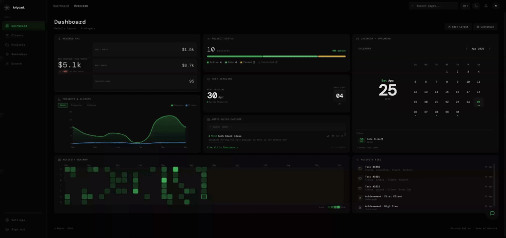

*This project has been created as part of the 42 curriculum by mobouifr, oer-refa, soel-mou, csouita, hichokri.*

---

<div align="center">

# Mycel — Freelancer CRM

[](https://react.dev)
[](https://nestjs.com)
[](https://www.postgresql.org/)
[](https://www.docker.com/)

</div>

<div align="center">
  
  <sub>Dashboard preview — animated overview of the interface</sub>
</div>

---

## Table of Contents

- [Description](#description)
- [Team Information](#team-information)
- [Project Management](#project-management)
- [Technical Stack](#technical-stack)
- [Database Schema](#database-schema)
- [Features List](#features-list)
- [Modules](#modules)
- [Individual Contributions](#individual-contributions)
- [Instructions](#instructions)
- [Resources](#resources)

---

## Description

**Mycel** is a full-stack web application that gives freelancers a unified workspace to run their business. Instead of juggling separate tools, everything lives in one place: client records, project tracking, a calendar, notes, revenue analytics, and even an AI assistant that understands the user's business data. The platform is named **Mycel** — a reference to mycelium, the fungal network that connects and nourishes ecosystems, mirroring the goal to connect every aspect of a freelancer's workflow into a single, living system.

| Category | Feature |
|---|---|
| **Authentication** | Email/password login, 42 OAuth single sign-on, Two-Factor Authentication (TOTP), JWT via HttpOnly cookies |
| **Client Management** | Full CRUD with server-side search, multi-field sorting, and cursor-based pagination |
| **Project Management** | Status lifecycle (Active → Completed / Paused / Cancelled), priority levels, budget and deadline tracking |
| **Dashboard** | Configurable widget grid with real-time SSE updates — Revenue KPI, Activity Heatmap, Activity Feed, Project Status Bar, Data Graph, Calendar, Notes, Next Deadline |
| **Calendar & Reminders** | Four-mode calendar (Month / Week / Day / Lane), event scheduling with client/project tags, pinnable colour-coded notes |
| **AI Chatbot** | DeepSeek LLM with live CRM context injection, token-streaming via SSE, Markdown/code rendering, per-user rate limiting |
| **Gamification** | XP and level progression triggered by CRM actions; collectible achievements and badges |
| **Notifications** | Real-time bell badge powered by SSE; read/unread tracking; deep-link navigation to related entities |
| **Internationalisation** | Full English / French / Spanish UI with browser-language auto-detection and runtime switching |
| **Monitoring** | Prometheus metrics, Grafana dashboards, PostgreSQL exporter, daily automated backups |

---

## Team Information

### mobouifr — Montassir Bouifraden
**Roles:** Product Owner · Tech Lead · DevOps · Backend · Frontend
Product vision and backlog ownership, feature scope decisions, acceptance criteria definition, and evaluation readiness. Managed CI/CD, Docker Compose maintenance, backend architecture, testing infrastructure, server-side sorting, cursor pagination, notifications module backend, security fixes, dead code audits, and bug triage. Built the dashboard widget grid, Calendar and Reminders UI, chatbot UI/UX widget, frontend routing, and robust layout systems.

### oer-refa — Othmane Er-Refaly
**Roles:** Backend Lead · Project Manager / Scrum Master
Project planning, coordination, deadline tracking, team communication workflows, and blocker management. Constructed core authentication features (JWT/HttpOnly-cookie, 42 OAuth, Two-Factor Authentication), managed Prisma schema workflows, and developed the real-time SSE infrastructure (`globalMutation$` bus). Created dashboard analytics APIs (revenue, heatmap, activity feed) and the backend for Reminders/Calendar.

### soel-mou — Solayman
**Roles:** DevOps · Backend
Maintained the Docker Compose stack (Nginx, Postgres, monitoring, backup services) and Prisma schema ownership/migrations. Integrated the AI Chatbot module utilizing the DeepSeek API, SSE streaming, CRM context injection, and rate limiting. Handled Prometheus/Grafana provisioning, i18n architectural pipelines, and Makefile automation.

### csouita — Souita
**Roles:** Backend Developer
Developed the Gamification module, implementing XP awards, level thresholds, and collectible achievements/badges. Authored the Notifications SSE architecture and managed the integration of gamification events directly with the app's notification streams.

### hichokri — Hiba Chokri
**Roles:** Frontend Developer
Designed and built the Client and Project domains (list, detail, create, and edit pages). Executed the React Router background-location modal overlay pattern. Enforced complete form validation structures utilizing Zod and React Hook Form.

---

## Project Management

**Project Owner: mobouifr (Montassir Bouifraden)**
Defined and maintained the product vision, ensuring the team built the right features in the correct priority order. Handled the product backlog, feature descriptions, acceptance criteria, and made scope decisions when facing deadline pressure. Driven evaluation readiness by maintaining the module checklist, coordinating defense rehearsals, and ensuring all graded criteria were demonstrably complete end-to-end. 

**Project Manager / Scrum Master: oer-refa (Othmane Er-Refaly) & hichokri (Hiba Chokri)**
Organized team meetings and planning sessions to align priorities and feature domain ownership. Tracked progress precisely across evaluation checkpoints and facilitated necessary continuous team communication.

**Technical Lead / Architect: soel-mou (Solayman)**
Defined system architecture and established clear module boundaries to streamline workflow. Documented major design decisions, reviewed critical pull requests (focusing on security, performance, and infrastructure), and provided mentorship across the team. Continuously refined best practices via retrospectives ensuring sustained code quality.

### Work Organisation

Domain ownership was strict: each developer owned individual feature domains end-to-end across frontend and backend boundaries. The strategy involved personal feature branches merging into an integration branch (`backDevops`), which was later promoted to `main` upon code review by the Tech Lead. The team utilized weekly syncs for planning and comprehensive dry-run sessions to evaluate defense readiness.

### Tools Used

| Purpose | Tool |
|---|---|
| Version control & code hosting | Git + GitHub |
| Issue / task tracking | Linear + GitHub branch routing + discussion threads |
| Communication | Discord + WhatsApp + Linear comments |
| API testing | Postman, cURL |
| Database inspection | Prisma Studio (`make studio`) |
| Container management | Docker Desktop / CLI |

---

## Technical Stack

### Frontend

| Technology | Version | Why it was chosen |
|---|---|---|
| **React** | 19.2.0 | Industry-standard component model; concurrent mode; robust ecosystem |
| **TypeScript** | ~5.9.3 | End-to-end type safety against API boundaries via shared DTOs |
| **Vite** | 7.3.1 | Sub-second HMR; tree-shaking; manual chunk splitting |
| **Tailwind CSS** | 4.2.1 | Utility-first approach ensures rapid UI iteration without cascading style conflicts |
| **React Router** | 7.13.1 | Background-location patterns enabling list pages to remain rendered beneath modal pages |
| **React Hook Form + Zod** | 7.72.0 / 4.3.6 | Uncontrolled forms granting schema-level validation and rendering efficiency |
| **Axios** | 1.13.6 | Configurable instances for unified error bubbling and authorization intercepts |
| **i18next** | 24.2.2 | Runtime language toggles paired with initial browser dialect auto-detection |
| **react-grid-layout** | 2.2.2 | Responsive, manipulatable drag-and-drop widget arrays |
| **react-markdown** | 10.1.0 | Parsing AI-furnished LLM replies (with `rehype-highlight` code styling) |

### Backend

| Technology | Version | Why it was chosen |
|---|---|---|
| **NestJS** | 10.x | Modular DI maps distinctly to CRM domains; robust pipeline (Guards, Interceptors) boilerplate reduction |
| **TypeScript** | 5.0.0 | Uniform runtime data interfaces correlating exactly with the web client |
| **Prisma ORM** | 5.21.1 | Migration-based schema evolution and query type-safety preventing SQL injection faults |
| **@nestjs/passport** | — | Strategy paradigm for standardizing Local, JWT, and 42 Intranet authorizations |
| **@nestjs/throttler** | 6.5.0 | Declarative request debouncing for API endpoints |
| **RxJS** | 7.8.0 | `Subject`-oriented reactive messaging utilized as a local SSE bus for realtime events |
| **otplib** | 12.0.1 | Algorithmic generation/verification for standard TOTP payloads (RFC 6238) |
| **nestjs-prometheus** | 6.1.0 | Seamless routing logic telemetry integration |

### Infrastructure

| Component | Choice | Justification |
|---|---|---|
| **Database Engine** | PostgreSQL 16 | ACID adherence, relational foreign-key integrity, flexible array types, extensive Prisma dialect support. |
| **Database UI** | Adminer 4.8.1 | Minimal resource footprint for graphical relational inspection querying. |
| **Containerisation** | Docker/Compose | Container isolation for disparate microservices, facilitating exact environment duplication. |
| **Reverse Proxy** | Nginx | API route multiplexing alongside local self-signed dev SSL termination capabilities. |
| **Monitoring** | Prometheus+Grafana | Declarative stack scraping alongside DB-level `postgres-exporter` insight parsing. |

### Major Technical Choice Justifications

- **NestJS over Express:** The module implementation enforces domain isolation; dependency injection yields vastly simpler and localized unit testing without broad context instantiation frameworks.
- **PostgreSQL over MongoDB:** The CRM platform embodies heavy relational coupling (User → Client → Project → Notification). Cascade constraints dictate structural safety entirely handled on the persistence layer rather than relying on application code logic mapping.
- **SSE over WebSockets:** CRM dashboards primarily require server-to-client pipelines. SSE operates directly above standard HTTP pipelines, avoids bi-directional firewall pitfalls, and consumes minimal process overhead. Leveraging RxJS `Subject` channels processes these singular DB mutations into highly concurrent outbound data streams.
- **DeepSeek API via SSE Tokens:** Provides an HTTP-streaming compatible open-source standard for LLM integration; processing token chunks minimizes visible latency while feeding dynamic Prisma schema context queries to synthesize highly aware business assistant logic.

---

## Database Schema

Relational logic ensures cascading deletions originating from the primary user token. Every record natively binds to the scoped `User` model, maintaining full multi-tenant isolation. 

### Model Reference

#### User
| Field | Type | Constraints |
|---|---|---|
| id | String (UUID) | Primary key, default: `cuid()` |
| email | String | Unique |
| username | String | default: `"User"` |
| intraId | String? | Unique; 42 OAuth mapping ID |
| isTwoFactorEnabled | Boolean | default: `false` |
| xp, level | Int | Logic mappings, default `0`, `1` |

#### Client
| Field | Type | Constraints |
|---|---|---|
| id | String (UUID) | Primary key |
| name | String | Required |
| userId | String | FK → User (cascade delete) |

#### Project
| Field | Type | Constraints |
|---|---|---|
| id | String (UUID) | Primary key |
| title | String | Required |
| status | Enum | `ACTIVE` / `COMPLETED` / `PAUSED` / `CANCELLED` |
| priority | Enum | `HIGH` / `MEDIUM` / `LOW` |
| userId, clientId | String | FK → User, FK → Client |

#### Notification
| Field | Type | Constraints |
|---|---|---|
| id | String (UUID) | Primary key |
| message, type | String | Categorization metadata |
| targetType, targetId | String? | Interface deep-link routing variables |
| userId | String | FK → User (cascade delete) |

#### Note & Event
| Field | Type | Constraints |
|---|---|---|
| id | String (UUID) | Primary key |
| title, content/description | String | String metrics |
| tags | String[] | Custom metadata labels |
| userId | String | FK → User (cascade delete) |

#### UserAchievement / UserBadge
| Field | Type | Constraints |
|---|---|---|
| type, name | String | Visual classification strings |
| userId | String | FK → User (cascade delete) |
| — | Unique | `(userId, type)` constraint enforcing singularity |

---

## Features List

*Note: All features are userId-scoped and require authentication to interface.*

### Authentication & Security
| Feature | Developer(s) | Description |
|---|---|---|
| Email / password auth | oer-refa | Local validation with deep bcrypt iterations (12 salts) issuing HTTP-Only tokenization. |
| 42 OAuth | oer-refa | Passport strategy validating callback handshakes, generating internal mapping identities. |
| Two-Factor Auth (TOTP) | oer-refa | Code parsing integration issuing active QR payloads; enforces conditional token issuance gates. |
| Global Throttling | mobouifr | Hard-capped rate limit middleware preventing volume DDoS vectors. |

### Client Management
| Feature | Developer(s) | Description |
|---|---|---|
| CRUD | hichokri, mobouifr | Regulated entity lifecycle; cascades delete events seamlessly. |
| Server-side sorting & search | mobouifr | Prisma query filtering interfacing seamlessly with configurable multi-column parameters. |
| Pagination schemas | mobouifr | Hardened `take` limits mapped over cursor anchor variables. |
| Modal background routing | hichokri | Decoupled nested route interfaces retaining cached array data visuals. |

### Dashboard
| Feature | Developer(s) | Description |
|---|---|---|
| Stateful Grid Render | mobouifr | Preserved user configurations mapping coordinates within a responsive drag interface. |
| Real-time SSE bindings | oer-refa, csouita | Subscribed event bus observing concurrent entity mutations. |
| Analytics Modules | oer-refa, mobouifr | Visual KPI renders parsing revenue, system logs, activity calendars, and next-action criteria. |

### Calendar & Reminders
| Feature | Developer(s) | Description |
|---|---|---|
| Semantic Views | mobouifr | Four visual variants (Month/Week/Day/Lane) parsing specific boundaries and bounds logic. |
| Entity Scheduling | mobouifr, oer-refa | Tagging schemas correlating dates directly to projects or client structures. |

### Notifications & AI
| Feature | Developer(s) | Description |
|---|---|---|
| Readstate Operations | mobouifr, csouita | Live badge indicators processing distinct read/unread matrices and batch cleanups. |
| LLM Query Stream | soel-mou | Parsed DeepSeek responses delivering segmented Markdown tokens referencing specific internal states. |

### Gamification & Internationalisation
| Feature | Developer(s) | Description |
|---|---|---|
| Threshold Awards | csouita | Algorithmic state updates monitoring active user footprints per-transaction. |
| Deep Locale Routing | soel-mou | Synchronous translations loading mapped JSON states based on navigator variants. |

---

## Modules

Modules follow the ft_transcendence Surprise evaluation grid.

| # | Module | Category | Type | Pts | Implementation Summary | Developer(s) |
|---|---|---|---|---|---|---|
| 1 | **Backend Framework (NestJS)** | Web | Minor | 1 | Configured DI architecture across domains. Decoupled services, interfaces, controllers and exception filters. | oer-refa |
| 2 | **ORM (Prisma)** | Web | Minor | 1 | Type-safe declarative database client. Implemented migration history logs and `$transaction` safety checks. | oer-refa |
| 3 | **OAuth 2.0 — 42 Intranet** | User Management | Minor | 1 | Oauth provider bridging user identity directly to local authentication tokens. | oer-refa |
| 4 | **Two-Factor Authentication** | User Management | Minor | 1 | Generated RFC-6238 TOTP logic enforced prior to localized JWT validation access steps. | oer-refa |
| 5 | **LLM System Interface** | Artificial Intelligence | Major | 2 | DeepSeek API injecting realtime backend CRM context databases, token-streamed directly over Observables. | soel-mou |
| 6 | **Monitoring System (Prometheus)** | DevOps | Major | 2 | Prometheus route logging mapped explicitly via Postgres-exporters yielding real-time latency graphs on Grafana. | soel-mou |
| 7 | **Health Check & Recovery** | DevOps | Minor | 1 | Alpine scheduling yielding timestamped db `.sql` clones compressed and accessible for explicit volume restoration. | soel-mou |
| 8 | **Frontend Framework (React)** | Web | Minor | 1 | Suspense-based SPA routing implementing explicit component state maps. | mobouifr, hichokri |
| 9 | **Custom Design System** | Web | Minor | 1 | Abstracted layout component indices standardizing specific design tokens (form, grid, colors, fonts). | mobouifr, hichokri |
| 10 | **Multiple Languages (i18n)** | Accessibility | Minor | 1 | Live state mutators fetching explicit ES/FR/EN dictionaries directly. | mobouifr, hichokri |
| 11 | **Advanced Search/Sort/Pagination** | Web | Minor | 1 | Prisma query boundaries executing parameter mapping directly inside unified DTO architectures. | mobouifr, hichokri |
| 12 | **Additional Browser Support** | Accessibility | Minor | 1 | Validated cross-compatibility matrices on Chrome, MS Edge, and Firefox. | mobouifr, hichokri |
| 13 | **Gamification System** | Gaming & UX | Minor | 1 | Trigger calculations appending transactional xp records mapping discrete graphical unlocks. | csouita |
| 14 | **Notification System** | Web | Minor | 1 | Subscribed endpoints iterating batch state alterations mapped specifically over navigation redirects. | csouita |
| 15 | **Customizable Dashboard** | Modules of Choice | Minor | 1 | Complex `react-grid-layout` rendering. | mobouifr, hichokri |
| 16 | **User Activity Analytics** | User Management | Minor | 1 | Activity graphs traversing complex month calculations. | mobouifr, hichokri, csouita |
| 17 | **Calendar & Reminders System** | Modules of Choice | Minor | 1 | Advanced boundary computations routing custom CRM data contexts natively. | mobouifr, hichokri |

> **Modules 15 (Customizable Dashboard): Why this qualifies:** Exceeds standard static dashboards by employing complex, persistent Cartesian layout coordinates requiring deep browser interaction mapping. Delivers highly specific value to CRM systems by placing dynamic, drag-and-drop metrics explicitly based on user behavioral preference into localized browser caching structures.
> 
> **Module 17 (Calendar & Reminders): Why this qualifies:** Achieved without any pre-built calendar libraries. Managing proper timezone matrices, leap bounds, week overflow, overlapping bounds, and linking them natively to deeply tied backend API calls delivers explicit complexity appropriate for a standard CRM application module point.

**Mandatory modules (14 pts minimum):** 1, 2, 3, 4, 5, 6, 8, 9, 10, 11, 12, 13, 14
**Bonus modules claimed (up to 5 pts):** 7, 15, 16, 17
**Total implemented:** 19 pts (14 mandatory + 5 bonus)

---

## Individual Contributions

### mobouifr (Montassir Bouifraden)
Product Owner, Tech Lead, DevOps, Backend and Frontend duties.
- Designed and authored full server-side sorting implementation and robust cursor-based pagination systems querying directly into CRM lists (`/clients`, `/projects`, and `/notifications`).
- Handled deep project testing procedures, compiling verification suites across 8 suites, heavily fortifying the notifications domain (composed of 28 distinct test constraints). 
- Executed strict systematic dead code audits resulting in the secure verification and removal of twenty-nine unnecessary dev, dummy, and test artifacts resolving TypeScript redundancies.
- Administered six exact backend corrections stabilizing critical domain logic: rectifying a leaking dashboard SSE filter, correcting misnamed achievement map triggers, isolating bad notification chronology sequencing triggers, repairing broken `createdAt` analytics assumptions, managing invalid `updateNote` returns, and destroying dead `weeklyRevenue` analytics processes.
- Contributed to containerized HTTPS environments and exact explicit frontend visual components (specifically `react-grid-layout` elements, the fully custom 4-mode Calendar structure, and interactive chatbot form components).

**Challenge.** A parallel worker process within Jest was consistently failing to properly kill test suites, leaving the console reporting force-exit delays. Investigating memory states revealed that deep `.setTimeout` iterations in `.Observable` SSE listeners were leaving asynchronous promises dangling post-test. Synchronizing the state map and ensuring `.afterEach` natively destroyed the `Subject.next()` chains cleanly resolved pipeline hangups entirely.

### oer-refa (Othmane Er-Refaly)
Backend Lead and Scrum Master.
- Wrote the complete integrated authentication lifecycle securing standard HttpOnly pipelines and integrated Passport strategies handling robust 42-Oauth profiles.
- Produced fully verified TOTP workflows mapping generated RFC compliant QRs to application states.
- Programmed deep relational backend schemas monitoring revenue KPIs, activity loops, and the entire real-time Notification bus via Prisma's observation streams.

**Challenge.** Global mutation data streams utilizing Nested DI frameworks would routinely instantiate individual scopes, causing endpoints to emit into the void. Modifying `PrismaService` architecture directly required implementing strict singleton (`DEFAULT`) directives to merge communication chains across controllers inherently.

### soel-mou (Solayman)
DevOps and Backend Infrastructure.
- Wrote deep explicit metrics logging procedures exporting relational data boundaries inherently into customized Grafana UI arrays.
- Scripted Nginx HTTPS boundaries passing exact payloads onto NestJS controllers, alongside alpine cron structures generating explicit, verifiable database redundancies.
- Composed the DeepSeek token-steaming integrations delivering system prompted CRM queries straight to clients via continuous browser chunks.
- Setup core architectural i18n configurations routing language state arrays visually.

**Challenge.** Massive injection prompts formatting the entire user's database directly to LLM queries tripped structural latency blocks aggressively. Filtering payload structures limiting specific parameters onto strictly active or recent properties effectively compressed AI transmission contexts by huge volumes without sacrificing insight accuracy.

### csouita (Souita)
Backend Developer mappings.
- Mapped deep analytical threshold variables compiling sequential logic updates across XP triggers formatting unique relational UserAchievements successfully.
- Coordinated the underlying architecture for notifications, explicitly parsing real-time mutation instances routing explicit string messages appropriately.

**Challenge.** Dense transaction structures processing immediate parallel logic chains (rapid back-to-back project closures) were overwriting single ID validations mapping multiple achievements improperly. Repurposing `upsert` calls matching strictly verified `(userId, type)` identifiers fully halted all rapid sequence anomalies.

### hichokri (Hiba Chokri)
Frontend Developer configurations.
- Abstracted generic API list models formulating strictly validated CRUD parameters formatting visual elements.
- Implemented multi-layered background navigational layouts routing specific URI IDs onto visually appealing Modals without destroying contextual application memory visually beneath the prompt.
- Validated external Form arrays via strict Zod typing schemes. 

**Challenge.** Implementing deep modal routing arrays triggered explicit type-errors processing state hooks generically. Mapping strict interface rules against React Router parameters bypassed traditional rendering logic bounds and completely structured native routing histories safely.

---

## Instructions

### Prerequisites
| Tool | Minimum Version | How to verify | Download |
|---|---|---|---|
| Docker Engine | 24.x | `docker --version` | [docs.docker.com](https://docs.docker.com/engine/install/) |
| Docker Compose | v2.x (plugin) | `docker compose version` | Included with Docker Desktop |
| Git | Any recent | `git --version` | [git-scm.com](https://git-scm.com) |
| `make` | Any | `make --version` | Pre-installed |

### Clone the Repository
```bash
git clone https://github.com/solacode-SC/freelancer-crm-final-project.git
cd freelancer-crm-final-project